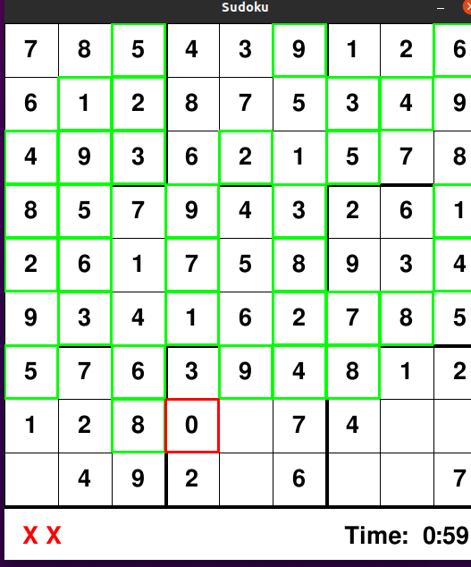

# Sudoku-Solver
Sudoku solver with GUI and also alows to play the game

*This was done in python using "pygame"*

<p align="center"></p>

Run solver.py file to play the game. 

The best way to solve the sudoku puzzels is usinf the **Backtracking algorithm**

# Requirements
The only requiremnet needed is pyagme.


*"Backtracking is an algorithmic-technique for solving problems recursively by trying to build a solution incrementally, one piece at a time, removing those solutions that fail to satisfy the constraints of the problem at any point of time (by time, here, is referred to the time elapsed till reaching any level of the search tree).*

*For example, consider the SudoKo solving Problem, we try filling digits one by one. Whenever we find that current digit cannot lead to a solution, we remove it (backtrack) and try next digit. This is better than naive approach (generating all possible combinations of digits and then trying every combination one by one) as it drops a set of permutations whenever it backtracks."*

Similarly, 
```bash
def valid(bo, num, pos):
    # Check row
    for i in range(len(bo[0])):
        if bo[pos[0]][i] == num and pos[1] != i:
            return False

    # Check column
    for i in range(len(bo)):
        if bo[i][pos[1]] == num and pos[0] != i:
            return False

    # Check box
    box_x = pos[1] // 3
    box_y = pos[0] // 3

    for i in range(box_y*3, box_y*3 + 3):
        for j in range(box_x * 3, box_x*3 + 3):
            if bo[i][j] == num and (i,j) != pos:
                return False

    return True
   ```
   is a function created to check if that perticular number is valid in that perticular position;
Depending on the value it returns the solve_gui() takes place recursively... which in this way uses the backtracking algorithm to solve the given sudoku grid.

-Rest of the code compises of the object and class concepts to give the charactristics to each and evry cell of the grid and 
uses the pygame modules and libraries to render the grid and other aspects.

*Instructions for game: *

*One can temporarily place the value in an empty cell and then change the it if needed and even can del it by (del) key, 
if the value for that cell is to be fixed then press enter after entering the value,
if correct(the value in that position is valid then a msg(success) is printed in terminal if wrong then the value is removed and msg(wrong) is given,
if one wishes to auto-solve it, then press(Space) to run the solve_gui() using the backtracking algorithm and it will complete it itself.*
